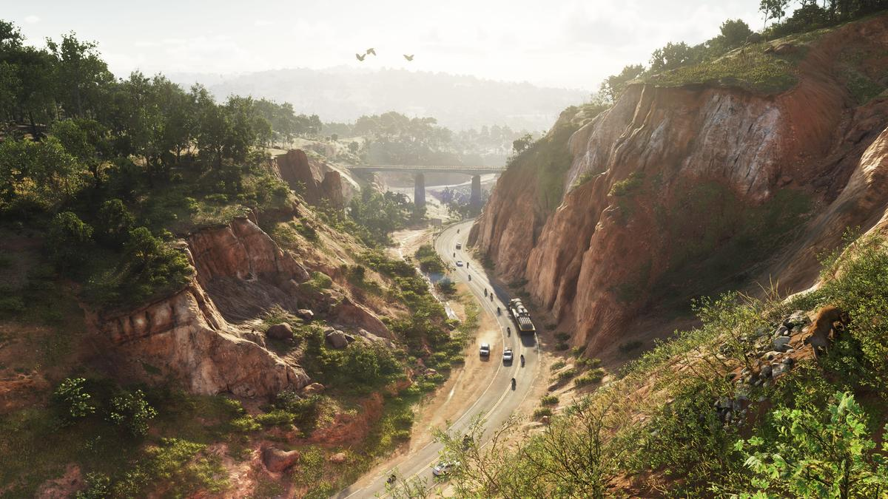

yaml
title: GTA VI: De Wildste Theorieën Over De Nieuwe Trailer
date: 2025-06-28 12:38:00 -200
categories: ["Nieuws", "Geruchten", "Rockstar Games"]
tags: ["vice city", "lucia", "jason", "trailer", "rockstar games", "ps5", "xbox series x", "xbox series s"]
```

# GTA VI: De Wildste Theorieën Over De Nieuwe Trailer

Na de release van een tweede trailer voor Grand Theft Auto VI, zijn fans volop bezig met speculeren over wat de game allemaal in petto heeft. De trailer biedt een glimp van de omgevingen, overvallen en nieuwe personages, en laat meer zien van het verhaal rondom Jason en Lucia. Dit heeft geleid tot een stroom van theorieën, variërend van het waarschijnlijk tot het ronduit wilde.



## Bekende Connecties en Oude Bekenden

Een van de meer vergezochte theorieën betreft een jacht die door fans opgemerkt is in de oprijlaan van Jason. Sommigen speculeren dat dit dezelfde jacht zou kunnen zijn als die van Michael De Santa uit GTA V. Hoewel het verleidelijk is om te denken dat er een verband is, lijkt het waarschijnlijker dat Rockstar simpelweg een bestaand model opnieuw gebruikt.

Een andere interessante theorie is de mogelijke terugkeer van Phil Cassidy, bekend uit GTA: Vice City. Fans vermoeden dat de versie van Phil die we kennen uit de eerdere games een fictieve filmversie was, en dat de 'echte' Phil nu zijn opwachting maakt in GTA VI. Ondanks deze theorieën, zou het net zo goed een easter egg kunnen zijn.

## Nieuwe Gameplay Mechanieken

De trailer onthult ook een console in Jason's huis die sterk lijkt op een PlayStation 5. Dit heeft geleid tot de theorie dat spelers in GTA VI mogelijk games binnen de game kunnen spelen, vergelijkbaar met hoe andere games zoals Uncharted 4 dit aanpakken. Een dergelijk concept zou een nieuwe dimensie toevoegen aan de spelervaring.

Daarnaast wordt er gespeculeerd over een systeem dat de relatie tussen Jason en Lucia zou beïnvloeden op basis van keuzes en dialogen. Dit zou de serie een stap dichter bij RPG-mechanieken brengen, vergelijkbaar met het Honor-systeem uit Red Dead Redemption 2.

## Open Wereld en Sociale Dynamiek

Er zijn geruchten dat maar liefst 70 procent van de gebouwen in GTA VI toegankelijk zal zijn, wat een enorme stap zou zijn voor de open wereld van de serie. Dit idee kwam voort uit een patent voor 'Interiors AI', wat zou kunnen zorgen voor procedureel gegenereerde interieurs.

Een andere waarschijnlijkheid is de integratie van een uitgebreid sociaal media mechaniek. Dit zou niet alleen als satire dienen, maar ook als een essentieel onderdeel van de gameplay, waarbij personages en misschien zelfs NPC's gebruik maken van sociale media in de game.

## Conclusie

Met de nieuwe trailer hebben fans een hoop om over te speculeren, en hoewel veel theorieën misschien vergezocht klinken, is het zeker dat Rockstar blijft verrassen. Of het nu gaat om oude bekenden die terugkeren, nieuwe gameplay systemen of een frisse kijk op sociale media, GTA VI belooft een spannende toevoeging aan de iconische serie te worden. Terwijl we wachten op de officiële release, blijven deze theorieën het gesprek van de dag onder fans.